# Vaultmux Architecture Document

> **Module:** `github.com/blackwell-systems/vaultmux`
> **Status:** Production
> **Author:** Blackwell Systems
> **Created:** 2025-12-07

---

## Executive Summary

Vaultmux is a Go library that provides a unified interface for interacting with multiple secret management backends. It abstracts away the differences between Bitwarden, 1Password, pass (Unix password manager), Windows Credential Manager, and AWS Secrets Manager, allowing applications to work with any supported backend through a single API.

**Key Features:**
- Unified `Backend` interface for all secret managers
- Session management with caching and refresh
- Context-aware operations with timeout support
- Location/folder management across backends
- Multiple integration patterns: CLI wrappers, native SDKs, OS APIs
- Minimal dependencies (stdlib + backend-specific SDKs only)

---

## Table of Contents

1. [Design Goals](#1-design-goals)
2. [Architecture Overview](#2-architecture-overview)
3. [Core Interfaces](#3-core-interfaces)
4. [Authentication Flow](#4-authentication-flow)
5. [Session Management](#5-session-management)
6. [CRUD Operations](#6-crud-operations)
7. [Backend Registration](#7-backend-registration)
8. [Error Handling](#8-error-handling)
9. [Testing Strategy](#9-testing-strategy)
10. [Backend Comparison](#10-backend-comparison)

---

## 1. Design Goals

### 1.1 Primary Goals

| Goal | Description |
|------|-------------|
| **Unified API** | Single interface works with any backend |
| **Minimal Dependencies** | Core has zero dependencies; backends add only what they need (CLIs or SDKs) |
| **Context Support** | All operations accept `context.Context` for cancellation/timeout |
| **Session Caching** | Avoid repeated authentication prompts |
| **Testability** | Mock backend for unit testing |

### 1.2 Non-Goals

| Non-Goal | Rationale |
|----------|-----------|
| GUI/TUI | Library only; consumers build their own UI |
| Backend installation | Users install `bw`, `op`, `pass` themselves |
| Encryption | Delegated to backend implementations |
| Key generation | Out of scope; use backend tools |

### 1.3 Design Principles

1. **Backends integrate natively** - CLI backends shell out to `bw`, `op`, `pass`; SDK backends use native clients (AWS SDK, Azure SDK)
2. **Fail fast, fail clearly** - Explicit errors over silent failures
3. **No global state** - All state lives in Backend/Session structs
4. **Functional options** - Extensible configuration without breaking changes
5. **Interface universality** - Same `Backend` interface works for CLI wrappers, OS APIs, and SDK clients

---

## 2. Architecture Overview

### 2.1 Package Structure

```
github.com/blackwell-systems/vaultmux/
├── vaultmux.go           # Core types: Backend, Session, Item, errors
├── factory.go            # New() factory, backend registration
├── session.go            # Session interface, caching logic
├── errors.go             # Typed errors: ErrNotFound, ErrAuth, etc.
│
├── backends/
│   ├── bitwarden/
│   │   ├── bitwarden.go  # Bitwarden CLI backend
│   │   └── session.go    # BW session management
│   │
│   ├── onepassword/
│   │   ├── onepassword.go # 1Password CLI backend
│   │   └── session.go     # OP session management
│   │
│   └── pass/
│       └── pass.go        # pass (GPG-based) backend
│
├── mock/
│   └── mock.go            # In-memory mock for testing
│
└── internal/
    └── exec/
        └── exec.go        # Command execution helpers
```

### 2.2 Component Architecture

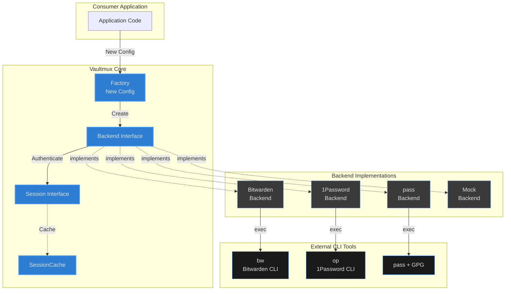

### 2.3 Data Flow

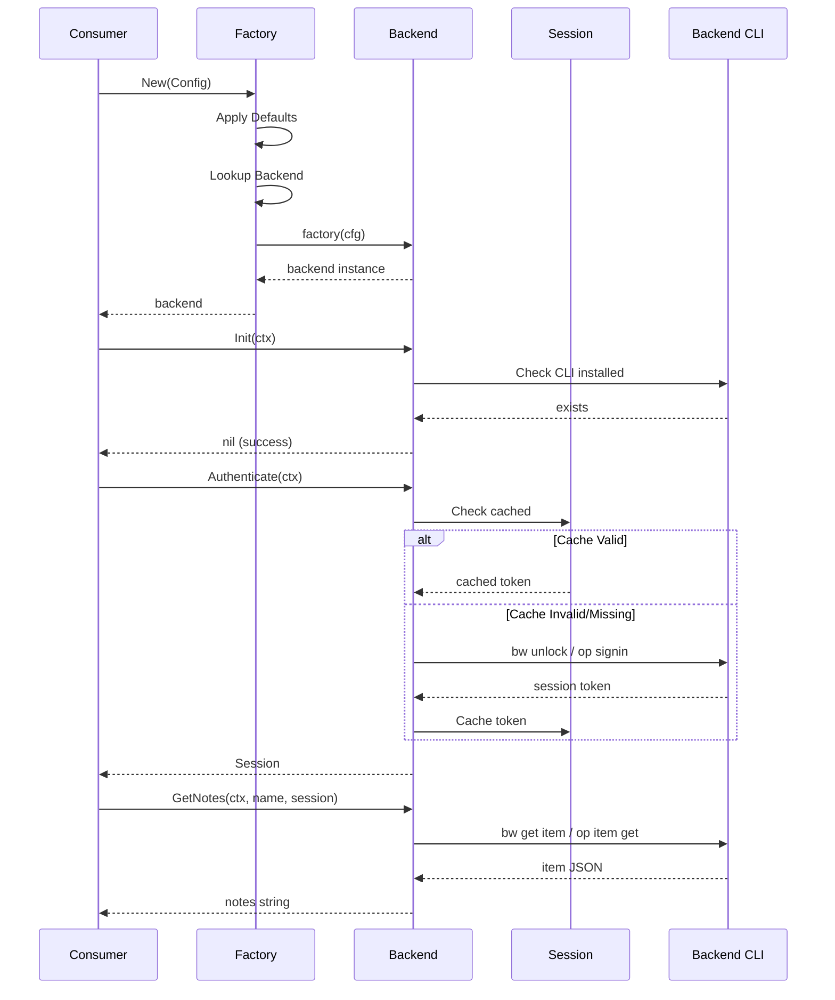

---

## 3. Core Interfaces

### 3.1 Backend Interface

```go
// Backend represents a secret storage backend.
type Backend interface {
    // Metadata
    Name() string

    // Lifecycle
    Init(ctx context.Context) error
    Close() error

    // Authentication
    IsAuthenticated(ctx context.Context) bool
    Authenticate(ctx context.Context) (Session, error)

    // Sync (pull latest from server)
    Sync(ctx context.Context, session Session) error

    // Item Operations (CRUD)
    GetItem(ctx context.Context, name string, session Session) (*Item, error)
    GetNotes(ctx context.Context, name string, session Session) (string, error)
    ItemExists(ctx context.Context, name string, session Session) (bool, error)
    ListItems(ctx context.Context, session Session) ([]*Item, error)

    // Mutations
    CreateItem(ctx context.Context, name, content string, session Session) error
    UpdateItem(ctx context.Context, name, content string, session Session) error
    DeleteItem(ctx context.Context, name string, session Session) error

    // Location Management (folders/vaults)
    LocationManager
}
```

### 3.2 Session Interface

```go
// Session represents an authenticated session.
type Session interface {
    // Token returns the session token (empty for pass).
    Token() string

    // IsValid checks if the session is still valid.
    IsValid(ctx context.Context) bool

    // Refresh attempts to refresh an expired session.
    Refresh(ctx context.Context) error

    // ExpiresAt returns when the session expires (zero for non-expiring).
    ExpiresAt() time.Time
}
```

### 3.3 Item Structure

```go
// Item represents a vault item.
type Item struct {
    ID       string            `json:"id"`
    Name     string            `json:"name"`
    Type     ItemType          `json:"type"`
    Notes    string            `json:"notes,omitempty"`
    Fields   map[string]string `json:"fields,omitempty"`
    Location string            `json:"location,omitempty"` // Folder/vault
    Created  time.Time         `json:"created,omitempty"`
    Modified time.Time         `json:"modified,omitempty"`
}

// ItemType indicates the type of vault item.
type ItemType int

const (
    ItemTypeSecureNote ItemType = iota
    ItemTypeLogin
    ItemTypeSSHKey
    ItemTypeIdentity
    ItemTypeCard
)
```

---

## 4. Authentication Flow

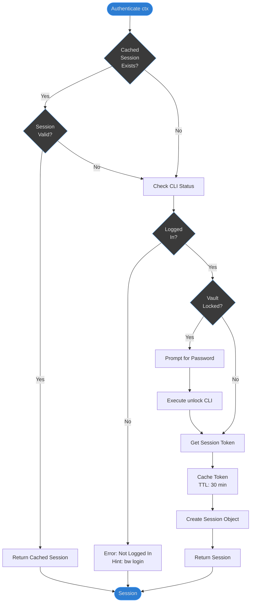

### 4.1 Authentication States

| State | Description | CLI Check | Action |
|-------|-------------|-----------|--------|
| **Unauthenticated** | Never logged in | `bw status` → unauthenticated | Prompt: `bw login` |
| **Locked** | Logged in but locked | `bw status` → locked | Execute: `bw unlock` |
| **Unlocked** | Active session | `bw unlock --check` → success | Use cached token |
| **Expired** | Session expired | Token fails validation | Re-unlock or refresh |

---

## 5. Session Management

### 5.1 Session Caching Strategy

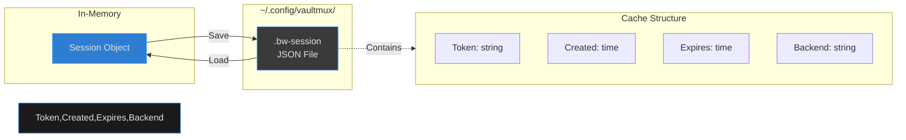

### 5.2 Cache Operations

```go
// SessionCache handles session persistence to disk.
type SessionCache struct {
    path string
    ttl  time.Duration
}

// Load reads a cached session from disk.
// Returns nil if cache doesn't exist, is invalid, or expired.
func (c *SessionCache) Load() (*CachedSession, error)

// Save writes a session to disk with restricted permissions (0600).
func (c *SessionCache) Save(token, backend string) error

// Clear removes the cached session.
func (c *SessionCache) Clear() error
```

### 5.3 Auto-Refresh Pattern

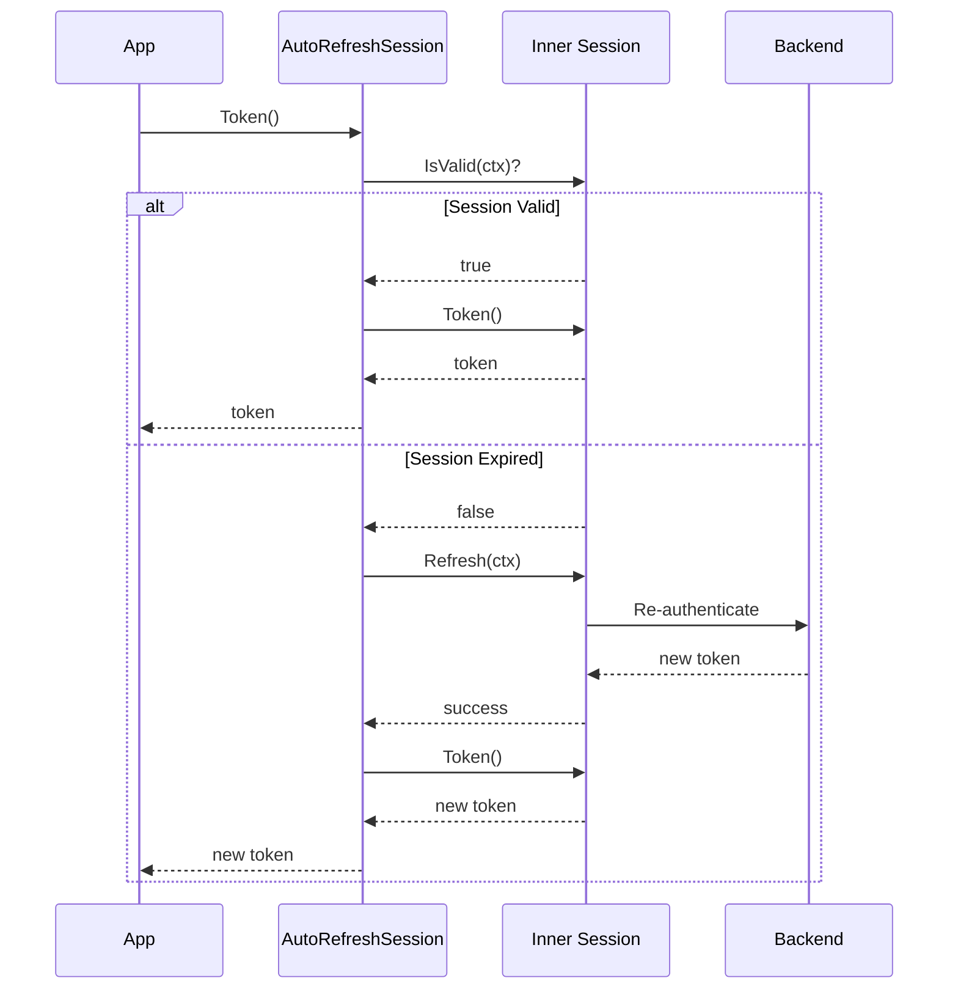

---

## 6. CRUD Operations

### 6.1 GetNotes Operation Flow

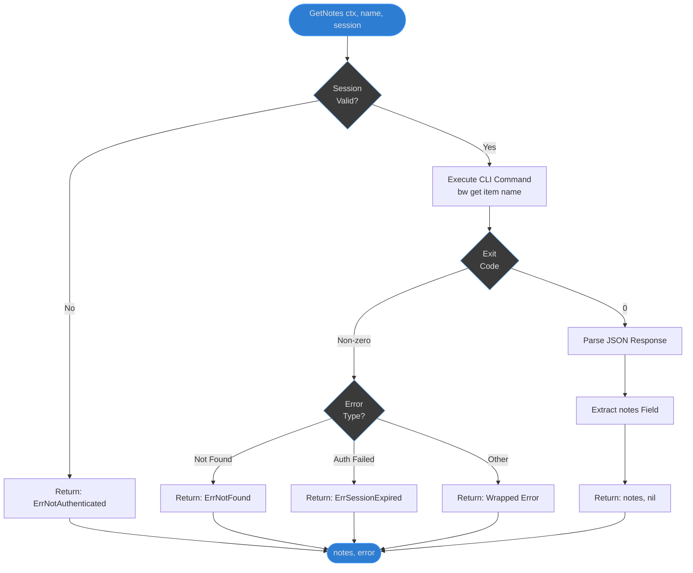

### 6.2 CreateItem Operation

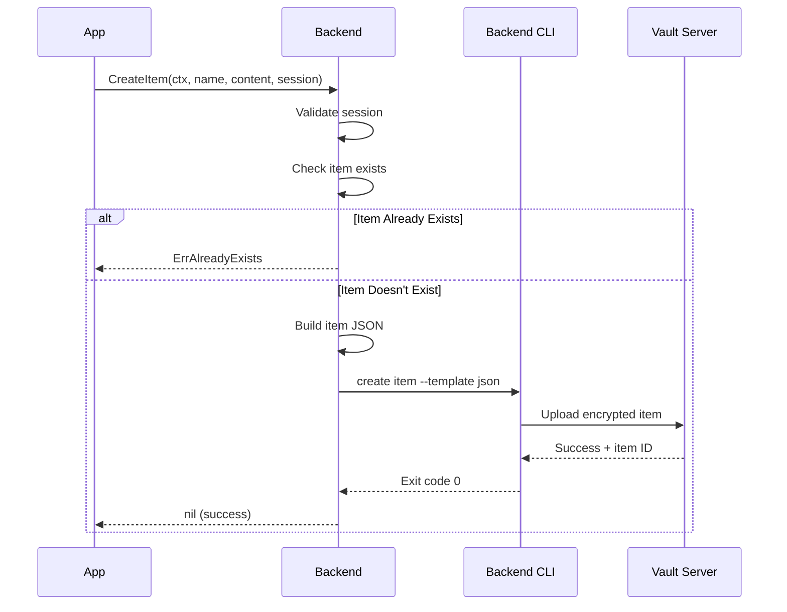

---

## 7. Backend Registration

### 7.1 Registration Pattern

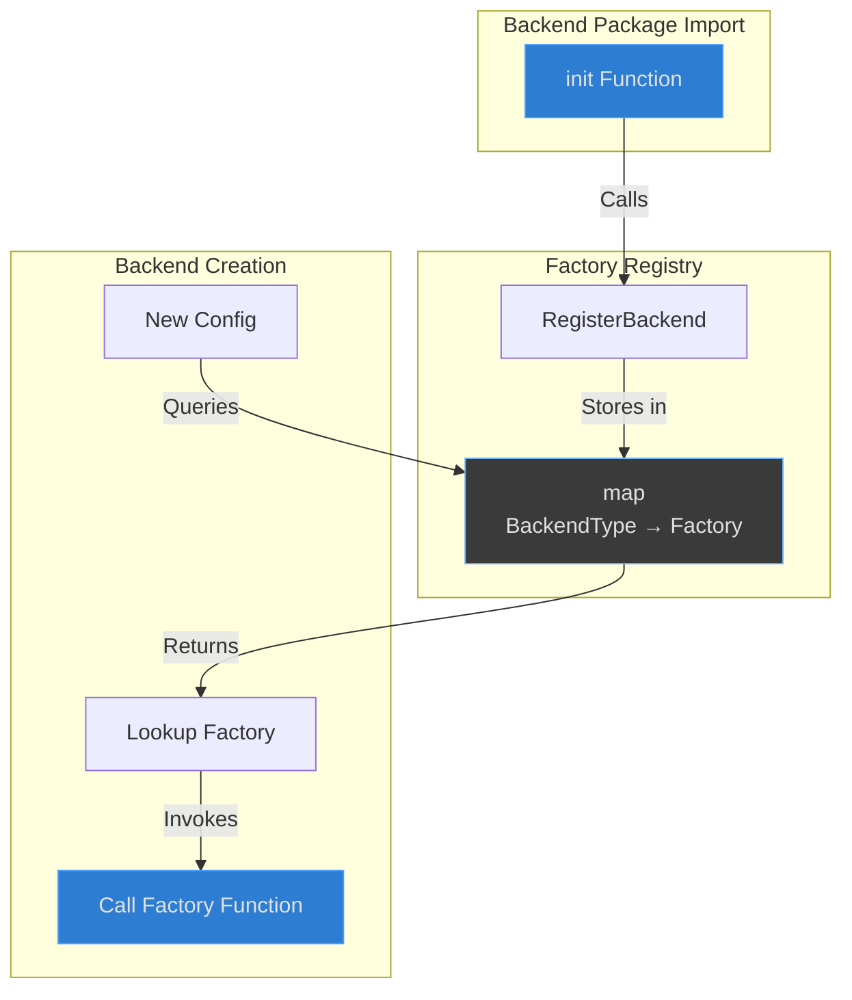

### 7.2 Example Backend Registration

```go
// In backends/bitwarden/bitwarden.go
package bitwarden

import "github.com/blackwell-systems/vaultmux"

func init() {
    vaultmux.RegisterBackend(vaultmux.BackendBitwarden, func(cfg vaultmux.Config) (vaultmux.Backend, error) {
        return New(cfg.Options, cfg.SessionFile)
    })
}
```

### 7.3 Consumer Usage

```go
// Consumer application
import (
    "github.com/blackwell-systems/vaultmux"
    _ "github.com/blackwell-systems/vaultmux/backends/bitwarden"  // Register via init()
)

func main() {
    backend, err := vaultmux.New(vaultmux.Config{
        Backend: vaultmux.BackendBitwarden,
    })
    // backend.init() was called during import
}
```

---

## 8. Error Handling

### 8.1 Error Types

```go
var (
    ErrNotFound            = errors.New("item not found")
    ErrAlreadyExists       = errors.New("item already exists")
    ErrNotAuthenticated    = errors.New("not authenticated")
    ErrSessionExpired      = errors.New("session expired")
    ErrBackendNotInstalled = errors.New("backend CLI not installed")
    ErrBackendLocked       = errors.New("vault is locked")
    ErrPermissionDenied    = errors.New("permission denied")
)
```

### 8.2 Error Wrapping

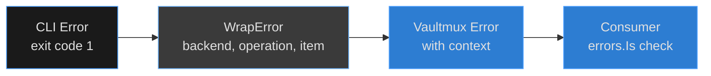

```go
// WrapError wraps CLI errors with context.
func WrapError(backend, operation, item string, err error) error {
    return fmt.Errorf("%s %s %q: %w", backend, operation, item, err)
}

// Consumer code
notes, err := backend.GetNotes(ctx, "SSH-Config", session)
if err != nil {
    if errors.Is(err, vaultmux.ErrNotFound) {
        // Item doesn't exist - create it
    }
    if errors.Is(err, vaultmux.ErrSessionExpired) {
        // Re-authenticate
    }
    return err
}
```

---

## 9. Testing Strategy

### 9.1 Test Pyramid

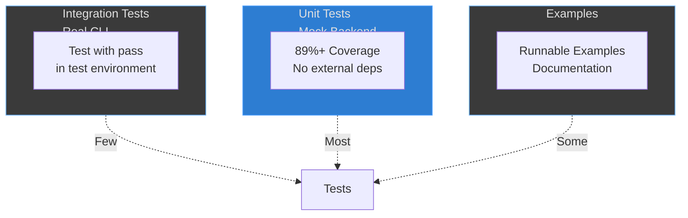

### 9.2 Mock Backend

```go
// Mock backend for unit testing
import "github.com/blackwell-systems/vaultmux/mock"

func TestMyCode(t *testing.T) {
    backend := mock.New()

    // Pre-populate with test data
    backend.SetItem("test-key", "test-value")

    // Test error conditions
    backend.GetError = errors.New("simulated error")

    // Your tests here...
}
```

---

## 10. Backend Comparison

### 10.1 Feature Matrix

| Feature | Bitwarden | 1Password | pass | Windows Cred Mgr | AWS Secrets Manager |
|---------|-----------|-----------|------|------------------|---------------------|
| **Integration** | CLI (`bw`) | CLI (`op`) | CLI (`pass`) | PowerShell | SDK (aws-sdk-go-v2) |
| **Auth Method** | Email/password + 2FA | Account + biometrics | GPG key | OS-level / Windows Hello | IAM credentials |
| **Session Duration** | Until lock | 30 minutes | GPG agent TTL | OS-managed | Long-lived (IAM) |
| **Sync** | `bw sync` | Automatic | `pass git pull/push` | None (local only) | Always synchronized |
| **Offline Mode** | Yes (cached) | Limited | Yes (local files) | Yes (always local) | No (requires AWS API) |
| **Folders** | Yes (folderId) | Vaults | Directories | No (flat namespace) | Prefix + tags |
| **Sharing** | Organizations | Vaults | Git repos | Windows user account | IAM policies |
| **Free Tier** | Yes | No | Yes (FOSS) | Yes (built-in) | No (~$0.40/secret/month) |
| **Self-Host** | Yes (Vaultwarden) | No | Yes (any git host) | N/A (local OS) | No (AWS only) |
| **Platform** | All | All | Unix | Windows only | All |
| **Versioning** | No | No | Via git | No | Automatic (built-in) |
| **Rotation** | Manual | Manual | Manual | Manual | Automatic (configurable) |
| **Audit Logging** | Self-hosted only | Enterprise only | Via git log | No | Built-in (CloudTrail) |

### 10.2 Implementation Differences

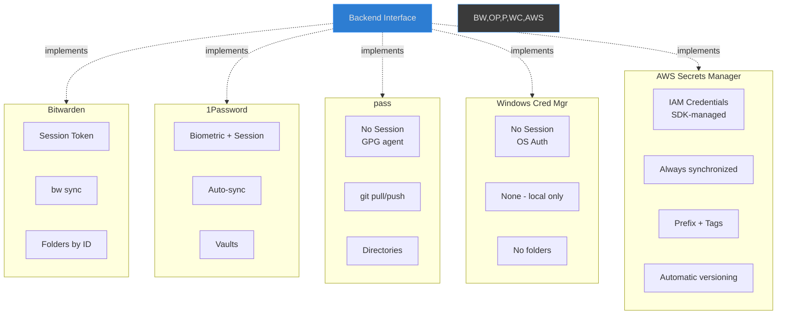

### 10.3 When to Use Each Backend

**Bitwarden:**
- Team/organization use
- Cross-platform sync needed
- Self-hosting preferred (Vaultwarden)

**1Password:**
- Enterprise environments
- Biometric auth important
- Watchtower/security features needed

**pass:**
- Unix power users
- Git-based workflow
- Minimal dependencies preferred
- Full offline support needed

**Windows Credential Manager:**
- Windows development environments
- No external tools or dependencies
- Windows Hello / biometric auth
- Single-machine secrets (no sync needed)
- Quick setup for Windows-only projects

**AWS Secrets Manager:**
- Applications running on AWS (EC2, ECS, Lambda, EKS)
- Automatic secret rotation needed (databases, API keys)
- IAM-based access control and fine-grained permissions
- Audit logging requirements (CloudTrail integration)
- Multi-region replication and disaster recovery
- Versioning and rollback capabilities
- Integration with AWS services (RDS, Redshift, DocumentDB)
- Teams already invested in AWS ecosystem

---

## Conclusion

Vaultmux provides a clean abstraction over multiple secret management backends, allowing applications to switch backends with minimal code changes. The architecture prioritizes simplicity, testability, and reliability by delegating backend-specific complexity to their respective CLIs rather than reimplementing protocols.

**Key Architectural Decisions:**
1. **Interface-first design** - Clear contracts between layers
2. **CLI delegation** - Leverage battle-tested implementations
3. **Session caching** - Balance security and UX
4. **Context propagation** - Proper cancellation and timeout support
5. **Type-safe errors** - Clear error handling patterns

**Extensibility:**
New backends can be added by implementing the `Backend` interface and registering via `RegisterBackend()` in the package's `init()` function. See [EXTENDING.md](EXTENDING.md) for details.

---

**Related Documentation:**
- [README.md](README.md) - Quick start and usage
- [EXTENDING.md](EXTENDING.md) - Adding new backends
- [Go Package Documentation](https://pkg.go.dev/github.com/blackwell-systems/vaultmux)
