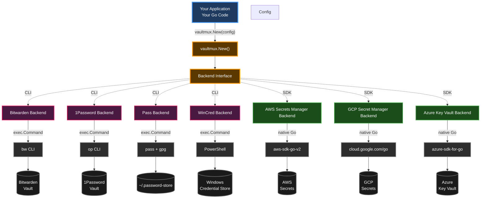

# Vaultmux

> **The definitive Go library for multi-vault secret management**

[](https://github.com/blackwell-systems) 
[](https://pkg.go.dev/github.com/blackwell-systems/vaultmux) 
[](https://go.dev/) 
[](https://github.com/blackwell-systems/vaultmux/releases) 

[](https://github.com/blackwell-systems/vaultmux/actions) [](https://codecov.io/gh/blackwell-systems/vaultmux)
[](https://buymeacoffee.com/blackwellsystems)
[](LICENSE) 

Vaultmux provides a unified interface for interacting with multiple secret management systems. Write your code once and support Bitwarden, 1Password, pass, Windows Credential Manager, AWS Secrets Manager, Google Cloud Secret Manager, and Azure Key Vault with the same API. Switch backends with zero code changes—perfect for multi-cloud deployments, cross-platform applications, and teams migrating between secret management solutions.

## Features

- **Unified API** - Single interface works with any backend
- **Minimal Dependencies** - Core has zero dependencies; AWS/GCP backends use official SDKs
- **Context Support** - All operations accept `context.Context` for cancellation/timeout
- **Session Caching** - Avoid repeated authentication prompts
- **Type-Safe** - Full static typing with Go interfaces
- **Testable** - Includes mock backend for unit testing (98%+ core coverage)

## Supported Backends

| Backend | Integration | Features | Platform |
|---------|-------------|----------|----------|
| **Bitwarden** | CLI (`bw`) | Session tokens, folders, sync | All |
| **1Password** | CLI (`op`) | Session tokens, vaults, auto-sync | All |
| **pass** | CLI (`pass` + `gpg`) | Git-based, directories, offline | Unix |
| **Windows Credential Manager** | PowerShell | OS-level auth, Windows Hello | Windows |
| **AWS Secrets Manager** | SDK (aws-sdk-go-v2) | IAM auth, versioning, rotation | All |
| **Google Cloud Secret Manager** | SDK (cloud.google.com/go) | ADC auth, auto-versioning, labels | All |
| **Azure Key Vault** | SDK (azure-sdk-for-go) | Azure AD auth, HSM-backed, RBAC | All |

## Why Vaultmux?

**The Problem**: Applications that hardcode a single secret management backend lock users into one workflow. Supporting multiple backends with different APIs creates maintenance nightmares—you end up writing the same logic multiple times with different method signatures, error handling, and authentication patterns.

**The Solution**: Vaultmux provides a unified API that eliminates repetition. Write your secret management code once, and it works with any backend. Users choose their preferred system without you writing backend-specific code.

## Use Cases

Vaultmux solves real problems in production environments:

- **Multi-cloud deployments** - Support AWS, GCP, Azure without code duplication
- **Cross-platform applications** - Native credential stores on Windows/macOS/Linux
- **Team flexibility** - Open source projects where contributors use different vaults
- **Development workflows** - `pass` locally, AWS Secrets Manager in production
- **Zero-downtime migrations** - Move from Bitwarden to AWS with phased rollout
- **Testing** - Mock backend for fast unit tests without real credentials
- **Vendor neutrality** - B2B SaaS where customers choose their cloud provider
- **Disaster recovery** - Multi-region failover when primary vault unavailable

**[📚 See detailed use cases with code examples →](docs/USE_CASES.md)**

**[🤔 Not sure if vaultmux is right for you? →](docs/DECISION_GUIDE.md)**

## Installation

```bash
go get github.com/blackwell-systems/vaultmux
```

## Quick Start

```go
package main

import (
    "context"
    "fmt"
    "log"

    "github.com/blackwell-systems/vaultmux"
)

func main() {
    ctx := context.Background()

    // Create backend (auto-detects ~/.password-store)
    backend, err := vaultmux.New(vaultmux.Config{
        Backend: vaultmux.BackendPass,
        Prefix:  "myapp",
    })
    if err != nil {
        log.Fatal(err)
    }
    defer backend.Close()

    // Initialize (checks CLI availability)
    if err := backend.Init(ctx); err != nil {
        log.Fatal(err)
    }

    // Authenticate (no-op for pass, interactive for Bitwarden/1Password)
    session, err := backend.Authenticate(ctx)
    if err != nil {
        log.Fatal(err)
    }

    // Store a secret
    err = backend.CreateItem(ctx, "API-Key", "sk-secret123", session)
    if err != nil {
        log.Fatal(err)
    }

    // Retrieve it
    secret, err := backend.GetNotes(ctx, "API-Key", session)
    if err != nil {
        log.Fatal(err)
    }
    fmt.Println("Secret:", secret)
}
```

## Configuration

```go
config := vaultmux.Config{
    // Backend type: "bitwarden", "1password", "pass", "wincred", "awssecrets", or "gcpsecrets"
    Backend: vaultmux.BackendPass,

    // Pass-specific
    StorePath: "/custom/path/.password-store", // Default: ~/.password-store
    Prefix:    "myapp",                        // Default: "dotfiles"

    // Session management (for Bitwarden/1Password)
    SessionFile: "/tmp/.vault-session", // Where to cache tokens
    SessionTTL:  1800,                  // Seconds (default: 30 minutes)

    // Backend-specific options
    Options: map[string]string{
        // AWS Secrets Manager:
        "region":   "us-west-2",              // AWS region
        "prefix":   "myapp/",                 // Secret name prefix
        "endpoint": "http://localhost:4566", // LocalStack endpoint (for testing)

        // Google Cloud Secret Manager:
        "project_id": "my-gcp-project",      // GCP project ID (required)
        "prefix":     "myapp-",              // Secret name prefix
    },
}

backend, err := vaultmux.New(config)
```

## Usage Examples

### With Timeout

```go
ctx, cancel := context.WithTimeout(context.Background(), 30*time.Second)
defer cancel()

notes, err := backend.GetNotes(ctx, "SSH-Config", session)
if err != nil {
    if ctx.Err() == context.DeadlineExceeded {
        log.Println("Operation timed out")
    }
    return err
}
```

### Error Handling

```go
notes, err := backend.GetNotes(ctx, "API-Key", session)
if err != nil {
    // Check for specific errors
    if errors.Is(err, vaultmux.ErrNotFound) {
        // Item doesn't exist - create it
        return backend.CreateItem(ctx, "API-Key", content, session)
    }
    if errors.Is(err, vaultmux.ErrSessionExpired) {
        // Re-authenticate and retry
        session, _ = backend.Authenticate(ctx)
        return backend.GetNotes(ctx, "API-Key", session)
    }
    return err
}
```

### Backend Auto-Detection

```go
func DetectBackend() vaultmux.BackendType {
    if _, err := exec.LookPath("bw"); err == nil {
        return vaultmux.BackendBitwarden
    }
    if _, err := exec.LookPath("op"); err == nil {
        return vaultmux.BackendOnePassword
    }
    if _, err := exec.LookPath("pass"); err == nil {
        return vaultmux.BackendPass
    }
    return "" // No backend available
}
```

### List and Sync

```go
// Pull latest from server (no-op for pass)
if err := backend.Sync(ctx, session); err != nil {
    return err
}

// List all items
items, err := backend.ListItems(ctx, session)
if err != nil {
    return err
}

for _, item := range items {
    fmt.Printf("- %s (type: %s)\n", item.Name, item.Type)
}
```

### Working with Locations (Folders/Vaults)

```go
// List locations (folders in Bitwarden, vaults in 1Password, directories in pass)
locations, err := backend.ListLocations(ctx, session)
if err != nil {
    return err
}

// Create a location
err = backend.CreateLocation(ctx, "work-secrets", session)
if err != nil {
    return err
}

// List items in a specific location
items, err := backend.ListItemsInLocation(ctx, "folder", "work-secrets", session)
```

## Testing

Vaultmux includes a mock backend for unit testing:

```go
import (
    "testing"
    "github.com/blackwell-systems/vaultmux/mock"
)

func TestMyCode(t *testing.T) {
    // Create mock backend
    backend := mock.New()

    // Pre-populate with test data
    backend.SetItem("test-key", "test-value")

    // Test error conditions
    backend.GetError = errors.New("simulated error")

    // Run your tests...
}
```

### Integration Tests

To run integration tests against real backends:

```bash
# Install pass and set up a test store
pass init test@example.com

# Run tests
VAULTMUX_TEST_PASS=1 go test -tags=integration ./...

# Or for other backends
VAULTMUX_TEST_BITWARDEN=1 go test -tags=integration ./...
VAULTMUX_TEST_1PASSWORD=1 go test -tags=integration ./...
```

## Architecture



See [ARCHITECTURE.md](docs/ARCHITECTURE.md) for detailed design documentation.

**Key Design Principles:**

1. **Backends integrate natively**: CLI backends shell out to `bw`, `op`, `pass`; SDK backends use native clients (AWS SDK v2)
2. **Fail fast, fail clearly**: Explicit errors over silent failures
3. **No global state**: All state lives in Backend/Session structs
4. **Functional options**: Extensible configuration without breaking changes

## API Reference

### Core Interfaces

```go
// Backend represents a secret storage backend
type Backend interface {
    Name() string
    Init(ctx context.Context) error
    Close() error

    IsAuthenticated(ctx context.Context) bool
    Authenticate(ctx context.Context) (Session, error)
    Sync(ctx context.Context, session Session) error

    GetItem(ctx context.Context, name string, session Session) (*Item, error)
    GetNotes(ctx context.Context, name string, session Session) (string, error)
    ItemExists(ctx context.Context, name string, session Session) (bool, error)
    ListItems(ctx context.Context, session Session) ([]*Item, error)

    CreateItem(ctx context.Context, name, content string, session Session) error
    UpdateItem(ctx context.Context, name, content string, session Session) error
    DeleteItem(ctx context.Context, name string, session Session) error

    LocationManager
}

// Session represents an authenticated session
type Session interface {
    Token() string
    IsValid(ctx context.Context) bool
    Refresh(ctx context.Context) error
    ExpiresAt() time.Time
}

// LocationManager handles organizational units
type LocationManager interface {
    ListLocations(ctx context.Context, session Session) ([]string, error)
    LocationExists(ctx context.Context, name string, session Session) (bool, error)
    CreateLocation(ctx context.Context, name string, session Session) error
    ListItemsInLocation(ctx context.Context, locType, locValue string, session Session) ([]*Item, error)
}
```

### Common Errors

```go
var (
    ErrNotFound            = errors.New("item not found")
    ErrAlreadyExists       = errors.New("item already exists")
    ErrNotAuthenticated    = errors.New("not authenticated")
    ErrSessionExpired      = errors.New("session expired")
    ErrBackendNotInstalled = errors.New("backend CLI not installed")
    ErrBackendLocked       = errors.New("vault is locked")
    ErrPermissionDenied    = errors.New("permission denied")
    ErrNotSupported        = errors.New("operation not supported")
)
```

## Backend Comparison

| Feature | Bitwarden | 1Password | pass | Windows Cred Mgr | AWS Secrets Manager |
|---------|-----------|-----------|------|------------------|---------------------|
| **Integration** | CLI (`bw`) | CLI (`op`) | CLI (`pass`) | PowerShell | SDK (aws-sdk-go-v2) |
| **Auth Method** | Email/password + 2FA | Account + biometrics | GPG key | Windows Hello/PIN | IAM credentials |
| **Session Duration** | Until lock | 30 minutes | GPG agent TTL | OS-managed | Long-lived (IAM keys) |
| **Sync** | `bw sync` | Automatic | `pass git pull/push` | N/A | Always synchronized |
| **Offline Mode** | Yes (cached) | Limited | Yes (local files) | Yes (local only) | No (requires AWS API) |
| **Folders** | Yes (folderId) | Vaults | Directories | Prefix-based | Prefix-based + tags |
| **Sharing** | Organizations | Vaults | Git repos | Machine-local | IAM policies |
| **Free Tier** | Yes | No | Yes (FOSS) | Yes (built-in) | No (~$0.40/secret/month) |
| **Self-Host** | Yes (Vaultwarden) | No | Yes (any git host) | N/A (OS feature) | No (AWS only) |
| **Platform** | All | All | Unix | Windows | All |

## Requirements

Each backend has different requirements:

```bash
# Bitwarden
npm install -g @bitwarden/cli

# 1Password
# See: https://1password.com/downloads/command-line/

# pass
apt-get install pass  # Debian/Ubuntu
brew install pass      # macOS

# Windows Credential Manager
# Built into Windows - no installation required!
# Uses PowerShell for credential access

# AWS Secrets Manager
# Requires AWS SDK v2 (automatically installed via go get)
# AWS credentials configured via:
#   - Environment variables (AWS_ACCESS_KEY_ID, AWS_SECRET_ACCESS_KEY)
#   - Shared credentials file (~/.aws/credentials)
#   - IAM instance role (for EC2/ECS)
```

## Security Considerations

1. **Session tokens are sensitive** - Stored with mode 0600, cleared on exit
2. **GPG agent passphrase caching** - Configure appropriate timeout
3. **CLI output may contain secrets** - Don't log full command output
4. **Context cancellation** - Ensure partial operations are safe
5. **Concurrent access** - Session refresh uses mutex protection

## Contributing

Contributions welcome! Please:

1. Fork the repository
2. Create a feature branch
3. Add tests for new functionality
4. Ensure all tests pass: `go test ./...`
5. Run linter: `golangci-lint run`
6. Submit a pull request

## License

**Versions >= v0.3.2**: Apache License 2.0
**Versions <= v0.3.0**: MIT License

See [LICENSE](LICENSE) for full Apache 2.0 text.

## Brand

The **code** in this repository is licensed under the Apache License 2.0. The **Blackwell Systems™** name and logo are protected trademarks. See [BRAND.md](BRAND.md) for usage guidelines.

## Credits

Created as part of the [blackwell-systems/blackdot](https://github.com/blackwell-systems/blackdot) project.
